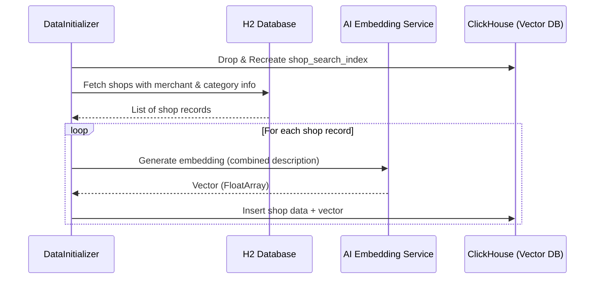
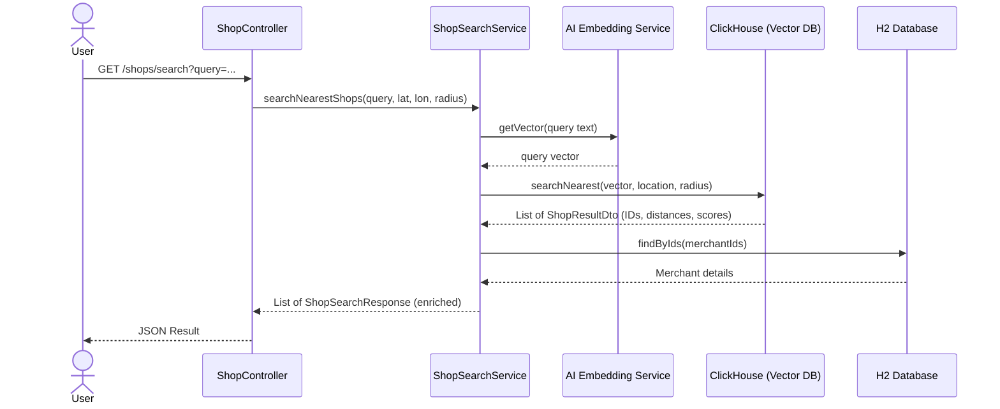

# Shop AI Search

A high-performance shop search service utilizing vector embeddings for semantic search across merchants and locations.

### Technologies
- **Kotlin & Spring Boot (WebFlux)**: Reactive backend architecture.
- **jOOQ**: Type-safe SQL querying for H2 and ClickHouse.
- **ClickHouse**: Used as a vector database for fast nearest neighbor search using `cosineDistance`.
- **H2 (MySQL Mode)**: Primary database for relational data (Merchants, Categories, Shops).
- **Flyway**: Database migration management.
- **HuggingFace / Ollama**: Integration for generating text embeddings.

### Key Features
- **Semantic Search**: Search for shops not just by name, but by description and category using AI embeddings.
- **Geospatial Filtering**: Combines vector search with geographic distance calculations (`greatCircleDistance`).
- **Automated Indexing**: `DataInitializer` synchronizes relational data from H2 to ClickHouse, generating embeddings on the fly.

### Project Structure
- `com.example.aisearch.service`: Core business logic for search and embedding generation.
- `com.example.aisearch.repository`: Data access layers for H2 (relational) and ClickHouse (vector).
- `com.example.aisearch.index`: Components for data synchronization and indexing.
- `src/main/resources/db/migration`: SQL schema and initial seed data (London-based).

### Sequence Diagrams

#### Data Indexing (Synchronization)
This process occurs on application startup (via `DataInitializer`), synchronizing relational data from H2 to the ClickHouse vector index.

#### Shop Search Process
How a user search query is processed from the API to the final enriched result.

### Getting Started
1. Configure your ClickHouse and Embedding Service (HuggingFace/Ollama) connection in `src/main/resources/application.yml`.
2. Run the application: `./gradlew bootRun`.
3. The `DataInitializer` will automatically populate the ClickHouse index on startup.

### API Endpoints
- `GET /shops/search`: Search for nearest shops using a text query and location coordinates.
